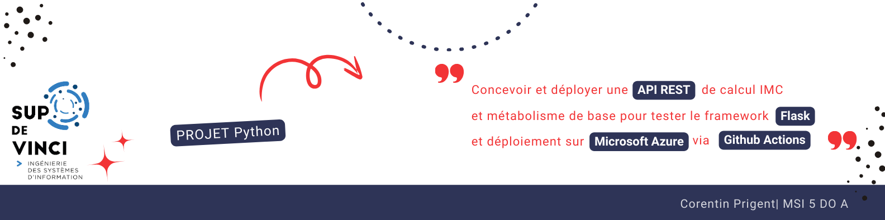

# ✨ python-for-devops showcase ✨




 
 


# Health Calculator API

## 🌍 Déploiement sur Azure
L'API est déployée via une **pipeline CI/CD GitHub Actions** sur **Azure App Service** et est accessible à l'URL suivante :

🔗 **[Health Calculator API](https://health-calculator-app-msi2doa-cprigent1-exb7feakamgjf3d3.francecentral-01.azurewebsites.net/)**

---

## 🧪 Tester l'API

### 🌟 **1. Tester avec `curl`**
#### **Calcul de l'IMC (BMI)**
```sh
curl -X POST -H "Content-Type: application/json" -d '{"height": 1.75, "weight": 70}' https://health-calculator-app-msi2doa-cprigent1-exb7feakamgjf3d3.francecentral-01.azurewebsites.net/bmi
```

#### **Calcul du BMR**
```sh
curl -X POST -H "Content-Type: application/json" -d '{"height": 175, "weight": 70, "age": 25, "gender": "male"}' https://health-calculator-app-msi2doa-cprigent1-exb7feakamgjf3d3.francecentral-01.azurewebsites.net/bmr
```

### 🌟 **2. Tester depuis le Swagger**
Rendez-vous à l'URL suivante: 
[Swagger Docs](https://health-calculator-app-msi2doa-cprigent1-exb7feakamgjf3d3.francecentral-01.azurewebsites.net/apidocs/)

puis suivez le guide :


### 🔹 **3. Tester avec un navigateur**
Allez sur :
```
https://health-calculator-app-msi2doa-cprigent1-exb7feakamgjf3d3.francecentral-01.azurewebsites.net/
```
Si l'application tourne correctement, vous devriez voir un message d'accueil.

---

## 🛠️ Builder l'application en local

### 🔹 **1. Cloner le dépôt**
```sh
 git clone https://github.com/<votre-repo>/health-calculator.git
 cd health-calculator
```

### 🔹 **2. Installer l'environnement Python**
Assurez-vous d'avoir Python 3.8 ou supérieur :
```sh
python -m venv my_venv
source my_venv/bin/activate
pip install -r requirements.txt
```

### 🔹 **3. Lancer l'API en local**
```sh
make run
```
L'API sera disponible sur `http://127.0.0.1:5000/`

### 🔹 **4. Exécuter les tests unitaires**
```sh
make test-api
```